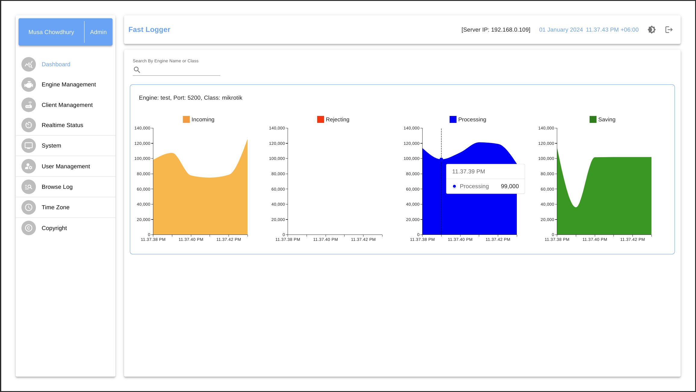
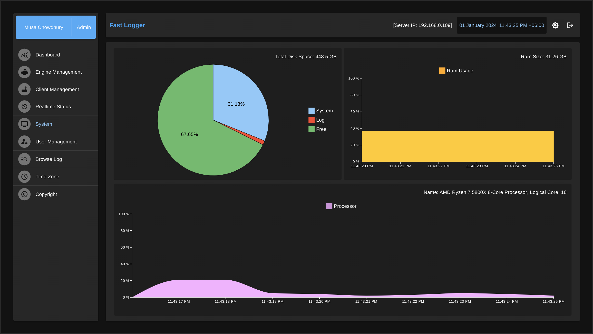
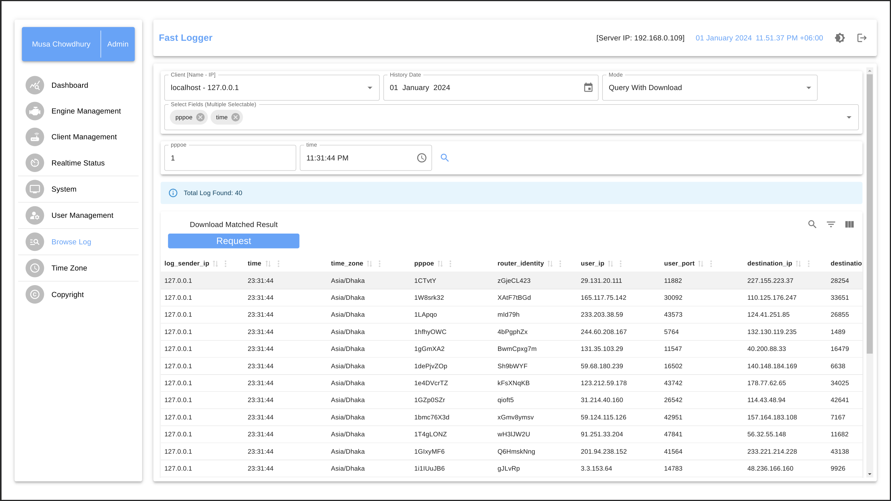

### Intro

Fast Logger is a syslog server (UDP). By using standard Python 3 regular expressions, you can filter any (if possible by regular expression) necessary data from incoming sources.

It is designed from the ground up for filtering capability from incoming sources in real time (almost) as well as saving the processed data to a database (SQL).

### Features

- Custom engine (Written in Python3)

- Optimized for multi-core processors

- Multiple engines can be created

- A single engine can receive, process, and save the incoming logs up to 90000-100000 per second in real-time. [tested on Ubuntu (Ryzen 7 5800x 8-core processor × 16, 32GB RAM, with Samsung SSD 970 EVO Plus), where the max buffer size of UDP socket was 212992, the average log size was around 250 bytes, and five regular expressions were applied]

- Real time status of each engine's working processes

- Auto deletes old logs (configurable)

- Regular expression grouping (in software it is called class)

- Option keep the original logs

- Download the saved logs as CSV

- Fully responsive UI made with React-18 and Material-UI 

- Access control

### Why?

The goal of the project is to provide a UDP log server for free also which is easy use.

Also allowing users to easily apply filters with the power of regular expression of python3.

### Use Case

Where logs need to be processed before saving and the processing includes filtering necessary data. If you don't need any filtering then it might not be a good option.

### **Requirements**

1. **Ubuntu** based distribution and version must be equal to **Ubuntu 22.04**

2. **Node.js 20** will be **installed automatically** if `install.sh` is used

3. **Python 3.10** is required to run the server

### Install

**It is strongly recommended to install the software on a fresh Ubuntu Server.**

Run `install.sh` to setup the application which can be located at root directory of the project. It will install the software at `~/fast_logger` and **saved files** can be found inside `~/fast_logger/LOG_DATABASE`.

To uninstall run `uninstall.sh`.

**Note**:

1. Both scripts require `sudo` privileges.

2. The `install.sh` script will **modify the sudoers** file to allow the server running the script to execute `reboot` and `timedatectl` without entering a password.

3. If you modify any default port or host, you will need to update the corresponding `nginx` configuration accordingly.

4. The uninstall.sh script will revert these changes. However, it will also **delete** any **sudoers** configurations **related to** `timedatectl set-timezone`, `reboot -f` and `timedatectl set-ntp true`.

5. You can add your own `SSL` certificate to the `~/fast_logger/ssl directory` after installation. Make sure to update the domain name in the existing `nginx` configuration.

6. The installation script will also create a `systemd` service to start the server when the computer boots.

7. If there are any `nginx` configurations existing in the system, **please create a backup**. If there are any `nginx` configurations present in the system, the script will **disable** them and move them to `/etc/nginx/old-sites-configs`. The uninstall script will restore them but will remove the Fast Logger from the system.

### Some Examples Of User Interface

- **Engine Performance Charts**
  
  

- **System Status (Dark Mode)**
  
  

- **Client Management (Dark Mode)**
  
  

- **Browse Log** 
  
  

- **Edit Engine**
  
  

- **Some Examples Of Responsive UI** 
  
     

### How To Guide

Let's discuss how to use the software for filtering necessary data (tokens) from raw logs.

Let's say you have a log source that is located on a public network. The log source is a Mikrotik router device. Now you want to keep logs of users' visits to websites.

Some examples of raw logs sent by the Mikrotik router are (randomly generated):

- b'<869> 01:02:05 <u>**T8Y45jGZY**</u> prerouting: in:<pppoe-<u>**RRWLkNYEZ**</u>> out:(unknown 0), connection-state:established,snat proto TCP (ACK,FIN,PSH), 73.181.232.17:34921->**<u>176.13.130.56:13878</u>**, NAT (73.181.232.17:34921->95.110.59.28:11384)->176.13.130.56:13878, len 946'
- b'<337> 01:03:01 <u>**2lqWuDWw**</u> prerouting: in:<pppoe-<u>**uSZHIpJ5**</u>> out:(unknown 0), connection-state:established,snat proto TCP (ACK,FIN,PSH), 211.181.61.90:23302->**<u>47.174.155.108:33358</u>**, NAT (211.181.61.90:23302->169.185.98.182:33210)->47.174.155.108:33358, len 163' 

Now, from the incoming logs, if you want to filter out the necessary data (like underlined in the examples), you would use a regular expression like below:

- "pppoe": "in:<pppoe-([A-Za-z\\d]+)>"
- "router_identity": "\\d{1,2}:\\d{1,2}:\\d{1,2}\\s+(\\w+)"
- "destination_ip": "->(\\d{1,3}\\.\\d{1,3}\\.\\d{1,3}\\.\\d{1,3}:\\d+)"

This will result the output of the processed log inside database like this, (assuming the router IP address is  **103.7.4.241**)

| log_sender_ip | time     | time_zone  | pppoe     | router_identity | destination_ip | destination_port | original_log                          |
| ------------- | -------- | ---------- | --------- | --------------- | -------------- | ---------------- | ------------------------------------- |
| 103.7.4.241   | 01:02:05 | Asia/Dhaka | RRWLkNYEZ | T8Y45jGZY       | 176.13.130.56  | 13878            | <869> .... (rest of the original log) |
| 103.7.4.241   | 01:03:01 | Asia/Dhaka | uSZHIpJ5  | 2lqWuDWw        | 47.174.155.108 | 33358            | <337> .... (rest of the original log) |

Here notice we only gave the 3 regular expressions but there are more fields than 3.

Lets break it down,

- **log_sender_ip**, **time**, **time_zone** and **original_log** are generated by the engine itself. It also implies that server processes data according to received time of server's end. Because it is impossible (if not configured by user) to get the date and  time form the incoming raw log. Also date time can be easily tampered if sender changes the data time.

- **`'_ip' is a special keyword.`** it can used as **suffix** after any regular expression keywords. If it is used then it tells the engine that the regular expression will parse a IP4 address with port separated by ':'. It is build in engine because most log senders provide IP address and port in same format . Remember do not use **'_ip'** as a suffix if the log's IP address is not formatted with port like IP:Port.

- **'_ip'** will instruct the engine that the regular expression result will provide IP with port like IP:Port and they will be **treated as a group**. That is how server is getting additional fields.

Now that we have understood how the regular expression works, lets discuss how to configure these regular expressions so that system can understand,

- Single or multiple regular expression must be expressed under a **class**.

- The class names must be **unique**, also must be in **lowercase**  and only be constructed with **digits**, **letters** and **_**.

- The given class name of group of (or single) regular expression will be automatically detected by the system.

- Engine configured with a class will process the regular expressions of the class and multiple engine can have same class.

- In cases where you want to add regular expressions to an existing class and some engines are busy with that class, make sure you wait till they are finished working, or you have to manually add columns to the affected date-related database for the regular expression key(s) or delete the affected date-related database.
  
  The mentioned line will make more sense when you see how the engine saves data on storage. The engine creates a database with a respected date name, which means if it is February 12, 2023, then it will create a database named February 12, 2023. db. The database will have columns (some are auto-generated) that reflect the given class regular expression key names. So if you change a class that already has data saved on the mentioned day, then it will cause an error, resulting in **<u>no data being saved until the day ends</u>**. Or manually, you can **<u>delete the affected date related database</u>** and restart the server, and then the **<u>server will behave normally.</u>**

- The class name and related regular expressions should be passed to **GLOBAL_CONFIG.JSON** (which can be found in root directory) under **ENGINE_CLASSES** key like the format below, 
  
  {
  
  *...rest of the configurations...*
  
      "ENGINE_CLASSES": {
          "mikrotik": {
              "pppoe": "in:<pppoe-([A-Za-z\\d]+)>",
              "router_identity": "\\d{1,2}:\\d{1,2}:\\d{1,2}\\s+(\\w+)",
              "destination_ip": "->(\\d{1,3}\\.\\d{1,3}\\.\\d{1,3}\\.\\d{1,3}:\\d+)"
      }
  
  *...rest of the configurations...*
  
  }
  
  Here the class name is **mikrotik** and it has **three filters** applied.

- Following the rules you can add add as may as class needed to the configurations. 

### Architecture Of The System

The system architecture can be divided into followings,

- **Engine:** Engine is a **state less** class, by giving the regular expressions it just process it and forwards the results into an array which is received by database controller. For more information view **'backend/syslogger/engine.py'**

- **Engine Related Database:** It is build on top of **SQLite** database. It is paired with each engine when bridge starts an engine.  For more information view **'backend/syslogger/database.py'**

- **Engine Database Bridge:** As name suggests it connects engine and database as a pair. It is responsible for both starting, stopping, restating and delivering notification from engine and database. It exposes API to interface. For more information view **'backend/syslogger/bridge.py'**

- **Bridge Interface:** It exposes a HTTP server to local host and **binding port is derived** from connected **engine's binding port**. It exposes some API to factory so that multiple engine can be created, edited or deleted. For more information view **'backend/syslogger/interface.py'**

- **Interface Factory:** It lets you create multiple engines and save the configurations or loads the configurations into the system. It is directly connected to FastAPI through localhost and port information is collected from global configurations.

- **FastAPI:** Is act as the main server to communicate with front-end. It provides authentication, user management, web-socket notification system. It receives instruction from front-end and forwards them to interface factory.

- **Next & React:** Front-end is build using both of them with help of Material UI.

### Developer Note

For those who want to develop the project further, please first review how the 'engine.py', 'bridge.py', and 'database.py' connect together (all of them located under the syslogger module). After that, it will be easier to understand how the rest of the system works. 'interface.py' (located under syslogger module) and 'factory.py' (located under interfaces module) are just APIs to talk with 'bridge.py', and both of them have their own documentation. Just send a post request with any random string to each module, and the module will provide its documentation in reply. You can get the factory.py module's server port from the global configuration file located at the root of the project folder. You can get all related information about all running engines from the factory.

The syslogger module can be used as a standalone library to parse and save logs.

### Licencing

The project is published under an MIT license. **The license only applies to the "Fast Logger" itself**. It does not apply to the dependencies or any other software used to build the project.

**Please read the included 'DEPENDENCIES LICENSES' before using the software.**
